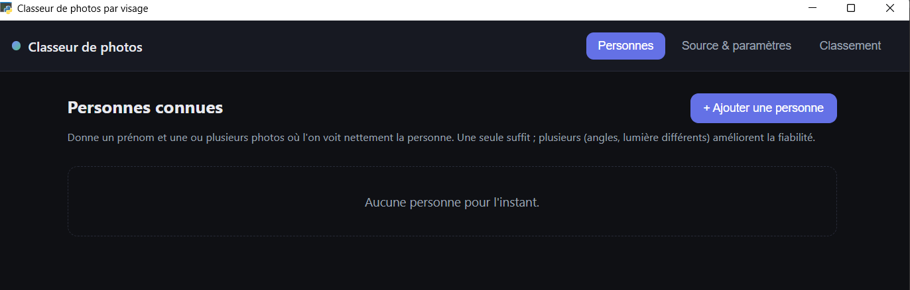

# 📸 Classeur de photos par visage

> Trie automatiquement tes photos dans des dossiers selon les personnes qui y figurent — **100 % en local**, sans cloud, sans API distante, sans envoi de tes images.


Ce programme classe les photos d'un disque physique en fonction des personnes présentes sur chaque photo.
par exemple vous avez 2324 photos d'un mariage et vous souhaitez que vos connaissances soient chacune dans un répertoire spécifique qui leur est dédié.
avec 2 ou 3 paramétrages simple, le programme va balayer vos 2324 photos et les classera dans les bons répertoires.

IMPORTANT : la reconnaissance faciale n'utilise aucune IA en ligne. votre PC peut être déconnecté du WEB. le programme fonctionnera quand meme.
Il est cependant nécessaire d'avoir une connexion web pour l'installation la première fois.
Ce programme a été entièrement généré par Claude.ai (aprés quelques ajustements à la marge)

---

## Aperçu




---

## ✨ Fonctionnalités

- **Mode référence, sans entraînement** : tu montres « qui est qui » avec une ou plusieurs photos par personne. Aucun apprentissage long, aucune carte graphique obligatoire.
- **Classement automatique** dans des dossiers nommés selon les personnes reconnues.
- **Photos de groupe gérées** : si plusieurs personnes connues sont présentes, la photo va dans un dossier `Prénom1_Prénom2_…`.
- **Aperçu (simulation)** de la répartition avant toute copie.
- **Copie par défaut** : tes originaux ne sont jamais modifiés (déplacement possible en option).
- **Interface de bureau moderne**, en français.
- **Confidentialité totale** : tout reste local.

---

## 🧠 Comment ça marche

L'application n'apprend pas les identités : elle s'appuie sur un modèle de reconnaissance
faciale **déjà entraîné**.

1. **Détection** des visages dans chaque image (MTCNN).
2. **Empreinte** : chaque visage est transformé en un vecteur de 512 nombres (FaceNet / InceptionResnetV1, modèle VGGFace2). Quelle que soit la pose, le même visage produit une empreinte proche.
3. **Comparaison** de chaque empreinte à la galerie de référence (similarité cosinus, seuil ajustable).
4. **Rangement** de la photo dans le dossier correspondant aux personnes reconnues.

Le modèle se télécharge une seule fois au premier lancement (~110 Mo), puis tout fonctionne hors-ligne.

---

## 🗂️ Règles de classement

| Contenu de la photo | Dossier de destination |
|---|---|
| 1 personne connue | `Prénom` |
| ≥ 2 personnes connues | `Prénom1_Prénom2_…` (ordre alphabétique) |
| Visage(s) mais aucun connu | `Inconnus` |
| Aucun visage détecté | `Sans visage` |

Les groupes sont triés alphabétiquement : « Alice avec Bob » et « Bob avec Alice » tombent
toujours dans le même dossier `Alice_Bob`. Au-delà de 6 personnes, le dossier est nommé
`Groupe_<hash>` avec un fichier listant les prénoms.

---

## 🧰 Pile technique

- **Python** 3.10 – 3.12
- **facenet-pytorch** (MTCNN + InceptionResnetV1 / VGGFace2) sur **PyTorch**
- **pywebview** — fenêtre native rendant une interface HTML / CSS / JS
- **Pillow**, **NumPy**

Aucun composant payant ; aucune compilation requise à l'installation.

---

## 🚀 Installation

### Windows 10/11
1. Installe **Python 3.12** depuis <https://www.python.org/downloads/windows/> en cochant **« Add python.exe to PATH »**.
2. Double-clique **`installer.bat`**, puis **`lancer.bat`**.

### macOS (11 Big Sur ou plus récent)
1. Installe **Python 3.12** depuis <https://www.python.org/downloads/macos/>.
2. Double-clique **`installer.command`**. macOS bloque les scripts téléchargés : au 1er lancement, fais plutôt **clic droit → Ouvrir → Ouvrir**. *(Si rien ne se passe, ouvre le Terminal dans le dossier et tape `chmod +x *.command`.)*
3. Double-clique **`lancer.command`** (même astuce clic droit → Ouvrir la première fois).

Aucune commande à taper en temps normal. Voir [`README_FR.md`](README_FR.md) pour le détail et le dépannage.

> **Apple Silicon (M1/M2/M3)** : coche « Utiliser le GPU » dans les réglages avancés pour activer l'accélération Metal (MPS).

---

## 📖 Utilisation

1. **Personnes** → *Ajouter une personne* : prénom, *Choisir des photos*, sélectionne le bon visage si besoin, *Enregistrer*.
2. **Source & paramètres** → choisis le dossier racine et le dossier de sortie (garde « Copier »).
3. **Classement** → *Lancer l'aperçu*, vérifie la répartition, puis *Lancer le classement*.

---

## 📁 Structure du projet

```
classeur-photos/
├── app.py              # Fenêtre + API exposée à l'interface
├── engine/
│   ├── faces.py        # Détection + empreintes (facenet-pytorch)
│   ├── classify.py     # Correspondance, règles de dossiers, copie
│   └── store.py        # Galerie, paramètres (persistance)
├── ui/                 # index.html, style.css, app.js
├── installer.bat
├── lancer.bat
└── README_FR.md
```

---

## 🔒 Confidentialité

Le traitement est entièrement local. Aucune photo, aucune empreinte faciale et aucune
donnée personnelle ne sont transmises sur Internet. Seul le téléchargement initial du
modèle nécessite une connexion, une seule fois.

---

## ⚠️ Limitations

- Les **profils complets** et les **visages de dos** ne sont pas reconnus (→ `Inconnus` / `Sans visage`).
- Le **HEIC (iPhone)** n'est pas inclus par défaut (conflit de dépendances avec le moteur) ; activable séparément.
- Sur **CPU**, le traitement d'une grosse photothèque peut être long.
- Le **seuil de ressemblance** peut nécessiter un ajustement selon tes photos.

---

## 📜 Licence

- **Code** : à toi de choisir (MIT recommandé pour un projet personnel). Pense à ajouter un fichier `LICENSE`.
- **Modèle** : les poids pré-entraînés FaceNet / VGGFace2 sont destinés à un usage de **recherche / personnel**. Vérifie leur licence avant tout usage commercial.

---

## 🙏 Crédits

- [facenet-pytorch](https://github.com/timesler/facenet-pytorch) — détection et empreintes faciales
- [pywebview](https://github.com/r0x0r/pywebview) — fenêtre de bureau

---

## 🛡️ Usage responsable

La reconnaissance faciale traite des **données biométriques**. Cet outil est prévu pour un
usage personnel sur tes propres photos. Respecte la vie privée des personnes concernées et
la réglementation applicable (RGPD en Europe) : n'analyse pas les photos de tiers sans base
légale appropriée.
